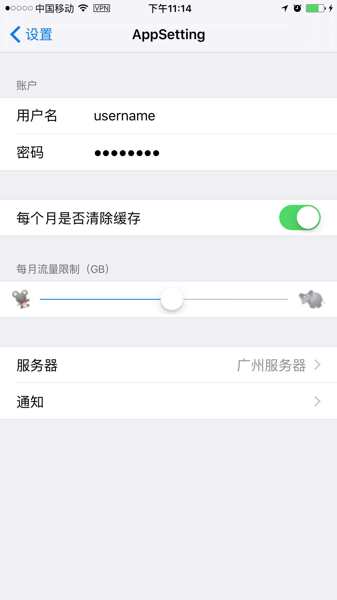
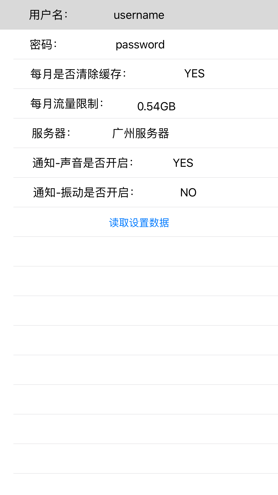

# AppSetting

### 一、概述
一个App的设置中，有“设置”和“配置”两种选择，其中“配置”的部分是更加偏向经常变化的，比如游戏的声音、地图中的显示模式等，是属于应用的一部分，它的界面布局、控件使用和事件处理等技术跟App本身功能的设计类似；而应用的设置是项目在使用中不经常变化的，它决定了应用的一些基本的行为和特征，如语言设置、账户信息等，同时设置也是应用之外的一个单独应用，在应用程序设置包Setting Bundle中，包含了设置界面所需要的设置项目的描述、用到的图片、文字的本地化和子设置界面设置项目的描述等内容。

本示例通过对一个游戏应用需要的设置内容：用户名、密码、服务器选择、音效开启、振动开启、流量限制、缓存等，对应用程序设置项目：文本字段、滑块、开关、值列表和子界面进行逐一介绍，并在应用中对设置数据进行读取和显示，具体运行界面如下：

### 二、设置界面：


### 三、设置数据读取显示：


### 四、设置项目要点

#### 1、文本字段
```xml
<!--账户设置 -->
        <dict>
            <key>Title</key>
            <string>账户</string>
            <key>Type</key>
            <string>PSGroupSpecifier</string>
        </dict>
        <dict>
            <key>Title</key>
            <string>用户名</string>
            <key>Type</key>
            <string>PSTextFieldSpecifier</string>
            <key>Key</key>
            <string>name_preference</string>
            <key>KeyboardType</key>
            <string>Alphabet</string>
            <key>AutocapitalizationType</key>
            <string>None</string>
            <key>AutocorrectionType</key>
            <string>No</string>
            <key>DefaultValue</key>
            <string></string>
            <key>IsSecure</key>
            <false/>
        </dict>
        <dict>
            <key>Title</key>
            <string>密码</string>
            <key>Type</key>
            <string>PSTextFieldSpecifier</string>
            <key>Key</key>
            <string>password_preference</string>
            <key>KeyboardType</key>
            <string>Alphabet</string>
            <key>AutocapitalizationType</key>
            <string>None</string>
            <key>AutocorrectionType</key>
            <string>No</string>
            <key>DefaultValue</key>
            <string></string>
            <key>IsSecure</key>
            <true/>
        </dict>
```

#### 2、开关
```xml
<!--是否缓存设置-->
        <dict>
            <key>Title</key>
            <string></string>
            <key>Type</key>
            <string>PSGroupSpecifier</string>
        </dict>
        <dict>
            <key>Title</key>
            <string>每个月是否清除缓存</string>
            <key>Type</key>
            <string>PSToggleSwitchSpecifier</string>
            <key>Key</key>
            <string>enabled_preference</string>
            <key>DefaultValue</key>
            <true/>
        </dict>

```

#### 3、滑块
```xml
<!--每月流量限制:其中由于将DefaultValue中值的类型写为string而无法显示滑动条-->
        <dict>
            <key>Title</key>
            <string>每月流量限制（GB)</string>
            <key>Type</key>
            <string>PSGroupSpecifier</string>
        </dict>
        <dict>
            <key>Type</key>
            <string>PSSliderSpecifier</string>
            <key>Key</key>
            <string>slider_preference</string>
            <key>DefaultValue</key>
            <real>0.5</real>
            <key>MaximumValue</key>
            <integer>1</integer>
            <key>MaximumValueImage</key>
            <string>elephant.png</string>
            <key>MinimumValue</key>
            <integer>0</integer>
            <key>MinimumValueImage</key>
            <string>mouse.png</string>
        </dict>

```

#### 4、值列表
```xml
<!--服务器和通知-->
        <dict>
            <key>Title</key>
            <string></string>
            <key>Type</key>
            <string>PSGroupSpecifier</string>
        </dict>
        <dict>
            <key>Title</key>
            <string>服务器</string>
            <key>Type</key>
            <string>PSMultiValueSpecifier</string>
            <key>Key</key>
            <string>multivalue_preference</string>
            <key>DefaultValue</key>
            <string>上海服务器</string>
            <key>Titles</key>
            <array>
                <string>上海服务器</string>
                <string>北京服务器</string>
                <string>广州服务器</string>
            </array>
            <key>Values</key>
            <array>
                <string>上海服务器</string>
                <string>北京服务器</string>
                <string>广州服务器</string>
            </array>
        </dict>

```

#### 5、子界面入口
```xml
<!--通知声音、振动设置子界面-->
        <dict>
            <key>Title</key>
            <string>通知</string>
            <key>Type</key>
            <string>PSChildPaneSpecifier</string>
            <key>File</key>
            <string>Notification</string>
        </dict>

```

#### 6、声音、振动子界面
```xml
<?xml version="1.0" encoding="UTF-8"?>
<!DOCTYPE plist PUBLIC "-//Apple Computer//DTD PLIST 1.0//EN" "http://www.apple.com/DTDs/PropertyList-1.0.dtd">
<plist version="1.0">
    <dict>
        <key>StringsTable</key>
        <string>Root</string>
        <key>PreferenceSpecifiers</key>
        <array>
            <dict>
                <key>Title</key>
                <string></string>
                <key>Type</key>
                <string>PSGroupSpecifier</string>
            </dict>
            <dict>
                <key>Title</key>
                <string>声音</string>
                <key>Type</key>
                <string>PSToggleSwitchSpecifier</string>
                <key>Key</key>
                <string>sound_enabled_preference</string>
                <key>DefaultValue</key>
                <true/>
            </dict>
            <dict>
                <key>Title</key>
                <string>振动</string>
                <key>Type</key>
                <string>PSToggleSwitchSpecifier</string>
                <key>Key</key>
                <string>vibrate_enabled_preference</string>
                <key>DefaultValue</key>
                <true/>
            </dict>
        </array>
    </dict>
</plist>
```

### 五、读取设置数据

#### 1、应用设置常用取值方法
* boolForKey: 根据键取出布尔值；
* floatForKey: 根据键取出float值；
* integerForKey: 根据键取出integer值；
* objectForKey: 根据键取出id类型值；
* stringForKey: 根据键取出NSString类型值；
* doubleForKey: 根据键取出double类型值；

#### 2、读取设置数据方法

```swift
//读取设置数据
    @IBAction func getData() {
        //获取NSUserDefaults实例
        let defaults = NSUserDefaults.standardUserDefaults()
        //读取用户名
        self.username.text = defaults.stringForKey("name_preference")
        //读取密码
        self.password.text = defaults.stringForKey("password_preference")
        //读取每月是否清除缓存
        if defaults.boolForKey("enabled_preference"){
            self.clearCache.text = "YES"
        }else{
            self.clearCache.text = "NO"
        }
        //读取没有流量限制
        let sliderStr = NSString(format: "%.2fGB", defaults.doubleForKey("slider_preference"))
        self.flowLimit.text = sliderStr as String
        //读取游戏服务器
        self.serverName.text = defaults.stringForKey("multivalue_preference")
        //读取是否开启声音
        if defaults.boolForKey("sound_enabled_preference"){
            self.notiSound.text = "YES"
        }else{
            self.notiSound.text = "NO"
        }
        //读取是否开启振动
        if defaults.boolForKey("vibrate_enabled_preference"){
            self.notiVibrate.text = "YES"
        }else{
            self.notiVibrate.text = "NO"
        }
    }

```
